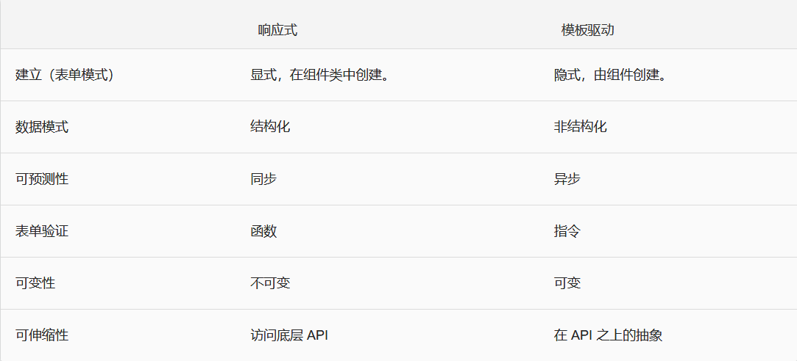

# Angular
   
- [Overview](#Overview)   
- [TemplateGrammar](#TemplateGrammar)
- [Directive](#Directive)  
- [Pipe](#Pipe)  
- [Http](#Http)
- [Server](#Server)
- [Forms](#Forms)  
- [Router](#Router)
   
## Overview 
- What?  
  Angular 是由谷歌开发与维护一个开发跨平台应用程序的框架，同时适用于手机与桌面。  
- Why?  
  - 基于 Angular 我们可以构建适用于所有平台的应用。比如：Web 应用、移动 Web 应用、移动应用和桌面应用等。
  - 通过 Web Worker和服务端渲染 (SSR)，达到在如今Web平台上所能达到的最高渲染速度。
  - Angular 让你能够有效掌控可伸缩性。基于 RxJS、Immutable.js 和其它推送模型，能适应海量数据需求。  
- 功能  
  - 动态HTML
  - 强大的表单系统 (模板驱动和模型驱动)
  - 强大的视图引擎
  - 事件处理
  - 快速的页面渲染
  - 灵活的路由
  - HTTP 服务
  - 视图封装
  - AOT、Tree Shaking  
- How?  
  - 安装 Angular CLI   
    `npm install -g @angular/cli`  
  - 初始化项目    
    `ng new my-app`  
  - 启动服务器    
    `ng serve --open`  
- 钩子函数(生命周期)  
  - 1.ngOnInit()          //在Angular第一次显示数据绑定和设置指令/组件的输入属性之后，初始化指令/组件。
  - 2.ngOnChanges()       //当Angular（重新）设置数据绑定输入属性时响应。
  - 3.ngOnDestroy()       //当Angular每次销毁指令/组件之前调用并清扫。（移除事件监听、清除定时器、退订 Observable ）
## TemplateGrammar  
- 组件的创建  
  `ng g component demo01`  
  `<app-demo01></app-demo01>`  
- 插值表达式    
  `<any>{{expression}}</any>`  
- 模板表达式  

## Directive  
- *ngFor  
  ```javascript
  <any *ngFor="let tmp of myList"></any>
  <any *ngFor="let tmp of myList;let myIndex=index"></any>
  ```  
- *ngSwitch  
  ```javascript  
  <div [ngSwitch]="expression">
    <p *ngSwitchCase="情况1"></p>
    <p *ngSwitchCase="情况2"></p>
    <p *ngSwitchCase="情况3"></p>
    <p *ngSwitchDefault></p>
  </div>
  ```  
- *ngIf  
  `<any *ngIf="expression"></any>`  
- NgNonBindable: 无需编译的html片段.  
- [NgStyle]  
- [NgClass]  
- 数据绑定  
  - 属性绑定  
    `<any [someProp]="expression"><any>`  
  - 事件绑定  
    `<button (click)="handleClick()"></button>`  
  - 双向数据绑定  
    1.配置:   
    ```javascript   
    /*src/app/app.module.ts*/
    import {FormsModule} from '@angular/forms'
    @NgModule({
      imports:[FormsModule]
    })  
    ```  
    2.调用(*.component.html):  
      `[(ngModel)]="value"`  
## Pipe  
  - what?  
    筛选、过滤、格式化 本质：有参数有返回值的方法.  
  - 官方管道:  
    - 1.number  
    - 2.slice  
    - 3.json  
    - 4.uppercase/lowercase  
    - 5.percent  
    - 6.currency  

  - 实例:  
    ```javascript
    <p>{{ 2000 | number }}</p>
    <p>The hero's birthday is {{ birthday | date }}</p>
    <p>{{ 'hellosmile' | uppercase }}</p>
    <p>{{ 'HELLOSMILE' | lowercase }}</p>
    <p>{{ "angular is cool" | slice:1 }}</p>
    ```  
  - output: 
    ```javascript
    2,000

    The hero's birthday is May 25, 2019

    HELLOSMILE

    hellosmile

    ngular is cool
    ```  
  - 自定义管道:  
    `ng g pipe pipeName`  
    - 实例(判断性别):  
        ```javascipt
        import { Pipe, PipeTransform } from '@angular/core';

        @Pipe({
          name: 'sex'
        })
        export class SexPipe implements PipeTransform {

          transform(value: number): any {
            if(value == 0) {
              return '你是女孩'
            }else if(value == 1) {
              return '你是男孩'
            }
          }
        }
        ```  
  - 调用(component.html):  
    `<p>{{ 0 | sex }}</p>`  
  - output:  '你是女孩'
## Http
- 父传子(prop down)  
  `<son myTitle="123"></son>`    
  ```javascript
  import {Input} from '@angular/core'     //导入模块
  @input() myTitle = ""                   //保存变量值
  this.myTitle(.ts)/{{ myTitle }}(.html)  //调用值
  ```  
- 子传父(event up):  
  -  父组件  
    父组件(*.component.html):  
    `<son (myEvent)="handleEvent($event)"></son>`  
    父组件(*.ts):    
    `handleEvent(opts) {opts}`  
  - 子组件  
    子组件(*.component.html):  
    `<button (click)="sendData()">clickMes</button>`  
    子组件(*.ts):  
    ```javascript  
    import {Output,EventEmitter} from '@angular/core'   //导入模块
    @Output() myEvent = new EventEmitter()              //实例化  
    sendData() {
      this.myEvent.emit(opts)                           //向父组件发送参数 
    }
    ```  
- 与远程服务器端的通信或网络通信(HttpClientModule,HttpClient)  
  - 步骤1: app.module.ts下引入HttpClientModule:  
    ```javascript
    import {HttpClientModule} from '@angular/common/http'  
    imports:[HttpClientModule]      //使 HttpClient 在应用中随处可用
  ```  
   - 步骤2: 在组件中调用HttpClient发起请求  
    ```javascript
      import {HttpClient} from '@angular/common/http'
      constructor(private myClient:HttpClient){}
      this.myClient.get/post().subscribe((result)=>{
        //result就是从服务器端请求到的数据
        //将result中数据保存，到视图中显示或者在组件类中做处理。。。
      })
    ```  
   HTTPMoudule[传送门](https://angular.cn/tutorial/toh-pt6)
## Server  
- 服务  
  - what?  
    本质就是一个类,在里面封装方法,数据  
  - why?  
    作用: 将不同组件要共享的数据和方法抽象出来  
  - How?:  
    `ng g service heart-beat`  
  - 实现服务:  定义需要的数据和方法  
  - 调用(组件是服务最大消费者):  
    ```javascript  
    import { HeartBeatService } from "/path"          //引入服务类
    constructor(private myService: HeartBeatService)  //实例化HeartBeatService类
    this.myService.methods()                          //调用实例类对象的方法
    ```  
## Forms  
- 响应式表单: 更健壮,它们的可扩展性、可复用性和可测试性更强。 如果表单是应用中的关键部分，或者你已经准备使用响应式编程模式来构建应用，请使用响应式表单。  
- 模板驱动表单: 在往应用中添加简单的表单时非常有用，比如邮件列表的登记表单。它们很容易添加到应用中，但是不像响应式表单那么容易扩展。如果你有非常基本的表单需求和简单到能用模板管理的逻辑，请使用模板驱动表单。  
- 两者的差异  
    

- 创建最简单的输入框  
  `<input type="text" [(ngModel)]="username">{{username}}`  
- 添加简单的验证功能  
  - required - 设置表单控件值是非空的
  - email - 设置表单控件值的格式是 email
  - minlength - 设置表单控件值的最小长度
  - maxlength - 设置表单控件值的最大长度
  - pattern - 设置表单控件的值需匹配 pattern 对应的模式  
  - 检查是否通过验证  
      通过`#userName="ngModel"`方式获取 ngModel 对象，然后通过`userName.valid`判断表单控件是否通过验证(返回true/false).  
      ```javascript
        <input 
          type="text" 
          required
          [(ngModel)]="username"
          #userName="ngModel">
        {{userName.valid}}
      ```  
- 显示验证失败的错误信息  
  通过`#userName="ngModel"`方式获取ngModel对象，然后通过该对象的errors属性，来获取对应验证规则 (如 required, minlength 等) 的验证状态。  
  ```
    <input 
    type="text" 
    required
    minlength="3"
    [(ngModel)]="username"
    #userName="ngModel">
    <div *ngIf="userName.errors?.required">请您输入用户名</div>
    <div *ngIf="userName.errors?.minlength">
      用户名的长度必须大于 {{userName.errors?.minlength.requiredLength}}，当前的长度为
        {{userName.errors?.minlength.actualLength}}
    </div>
  ```  
- 创建表单  
  - `<form>`创建表单  
    ```javascript  
    <form>
      <input 
      type="text" 
      required
      minlength="3"
      name="username"
      [(ngModel)]="username"
      #userName="ngModel">
      <div *ngIf="userName.errors?.required">请您输入用户名</div>
      <div *ngIf="userName.errors?.minlength">
        用户名的长度必须大于 {{userName.errors?.minlength.requiredLength}}，当前的长度为
          {{userName.errors?.minlength.actualLength}}
      </div>
      <button type="submit">提交</button>
    </form>
    ```  
  - 获取表单提交的值  
    通过`#loginForm="ngForm"`方式获取 ngForm 对象，然后通过`loginForm.value`来获取表单的值(loginForm.value | json)。 
- ngModelGroup    
  一个指令,语义化对表单内容分组.  
- 表单添加验证状态样式  
- 表单控件的状态  
- 使用单选控件  
- 使用多选控件  

## Router  
- 配置    
  - 1.创建自定义路由模块  
      `ng g module my-module --routing`   //记得注册到app.module.ts根模块 
  - 2.准备一个容器(父组件或根组件中*.component.html)  
      `<router-outlet></router-outlet>`  
      `forChild-->forRoot`  
  - 3.创建组件  
      ```
        Login/Register/Cart...
        ng g component demo13-login
        ng g component demo13-register
      ```  
  - 4.配置路由词典(my-module-routing.module.ts)  
      `{path:'',component:**}    //注意：path没有'/'!!!`  
- 跳转(Router):  
  - 1.编程跳转:  
    ```javascript  
    import {Router} from '@angular/router'      //引入Router模块
    constructor(private myRouter:Router){}      //实例化Router模块
    this.myRouter.navigateByUrl("/path")        //调用该类对象navigateByUrl()方法跳转
    ```  
  - 2.标签跳转  
    `<button routerLink="/path">跳转路由</button>`   
- 传参(ActivatedRoute):   
  - 发送参数  
    - 1.配置接收方的路由地址   
       `detail --> detail/:id`  
    - 2.静态发送参数   
      ```javascript
      <any routerLink="detail/3"></any>        //标签方式
      this.myRouter.navigateByUrl('detail/3')  //编程方式
      ```
    - 3.动态发送参数  
      ```javascript
      //标签方式
      <any routerLink="/path/{{opts}}"> 路由传参</any>      //推荐大胡子括号
      <any [routerLink]="'/path/'+opts">路由传参</any>      //使用绑定属性指令

      //编程方式
      let params;
      this.myRouter.navigateByUrl('detail/' + this.params);
      this.myRouter.navigateByUrl(`detail/${this.params}`);
      ```  
  - 接收参数  

    ```javascript
      import { ActivatedRoute } from '@angular/router'    //导入ActivatedRoute模块
      constructor(private myRoute:ActivatedRoute){}       //ActivatedRoute实例化
      this.myRoute.params.subscribe((result)=>{           //异步回调接收参数
        return result.id                                  //路由地址设置detail/:id和接收参数result.id两个属性名保持一致
      })
    ```  
- 路由的嵌套  
  - what?   
      一个spa，父组件A需要嵌套子组件B、C    
  - how?    
    - 1.给父组件A指定一个容器(顶级渲染出口)
      `<router-outlet></router-outlet>`   
    - 2.给父组件A的路由对象，添加一个children子路由对象      
      ```
      {
        path:'a',
        component:A,
        children:[
          { path:'b',component:B },
          ...
        ]
      }
      ```  
    - 调用:  
      `http://localhost:4200/a/b`  

- 路由守卫(canActivate)  
主要思路: 判断该页面(比如后台管理页面)是否显示  
操作步骤:  
  - 1.创建一个服务类,封装判断处理逻辑方法,数据  
      `ng g service my-guard`  
  - 2.封装判断处理逻辑方法,数据  
      ```javascript
      import {CanActivate} from '@angular/router'
          export class MyGuardService implements CanActivate{
        canActivate(){
          //在此来做一些功能处理 来决定是否可以访问你要保护的页面
          return true/false
        }
      }
      ```  
      3. 配置路由地址页面(my-module.ts)--皮卡丘,去守卫你保护的页面吧  
      ```javascript  
          import {MyGuardService} from '../my-guard.service'
          [
            {
              path:'admin',
              component:AdminComponent,
              canActivate:[MyGuardService]
            }
          ]
      ```   
Angular文档[传送门](https://angular.cn/docs) 